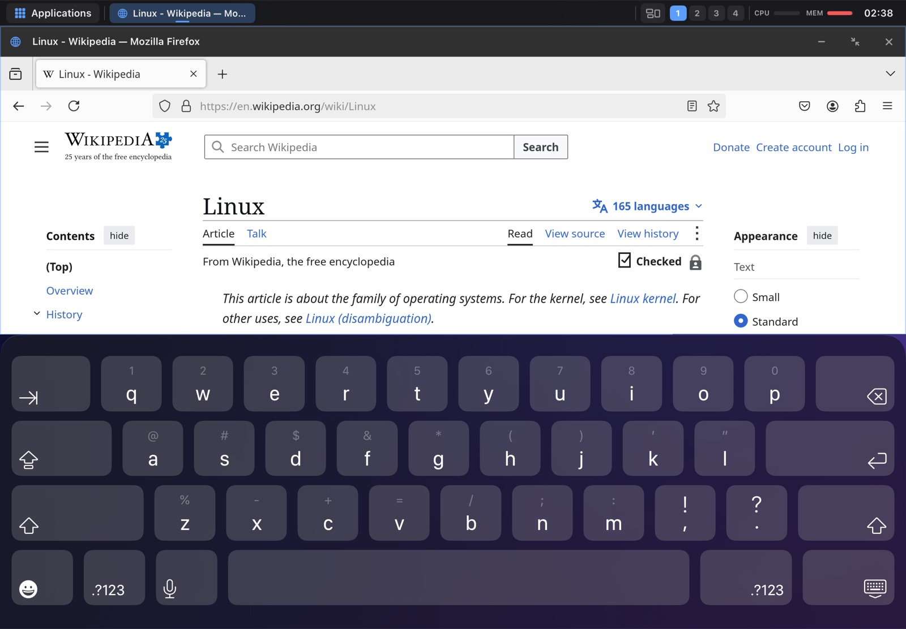
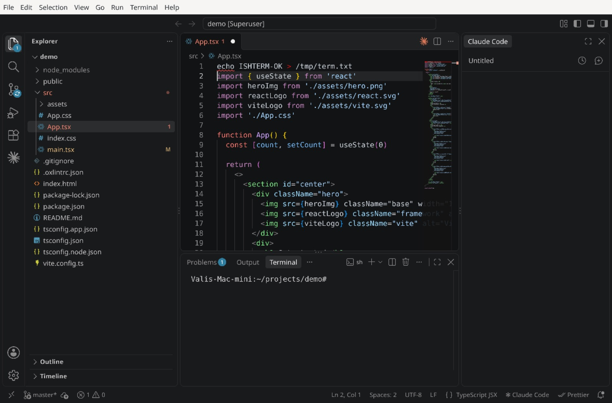
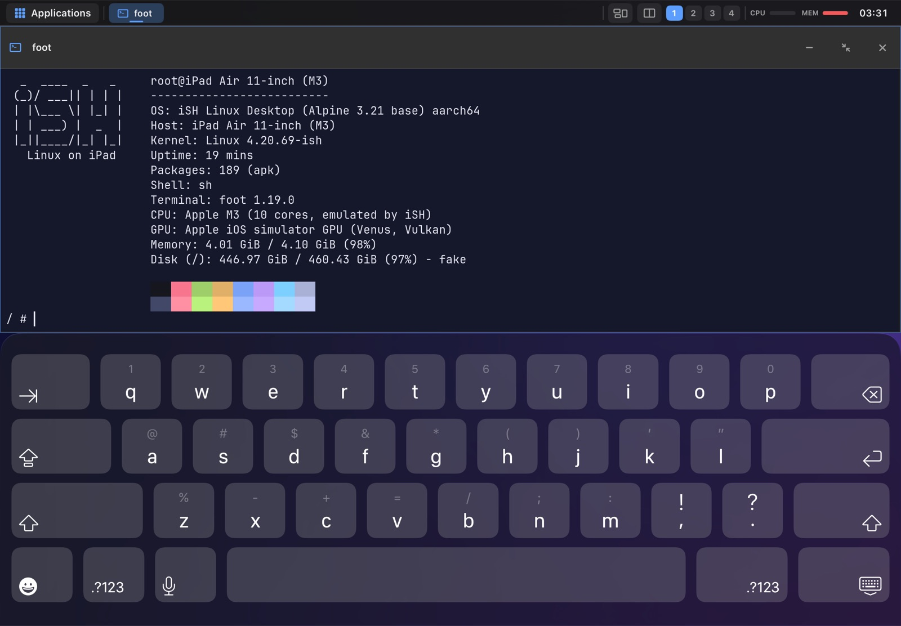
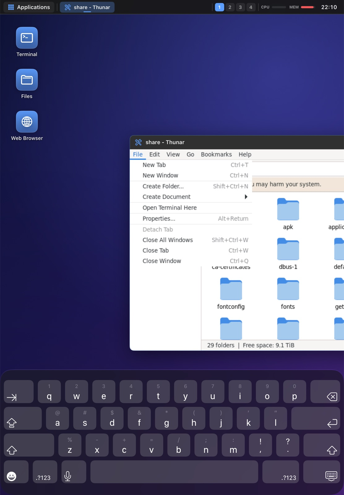
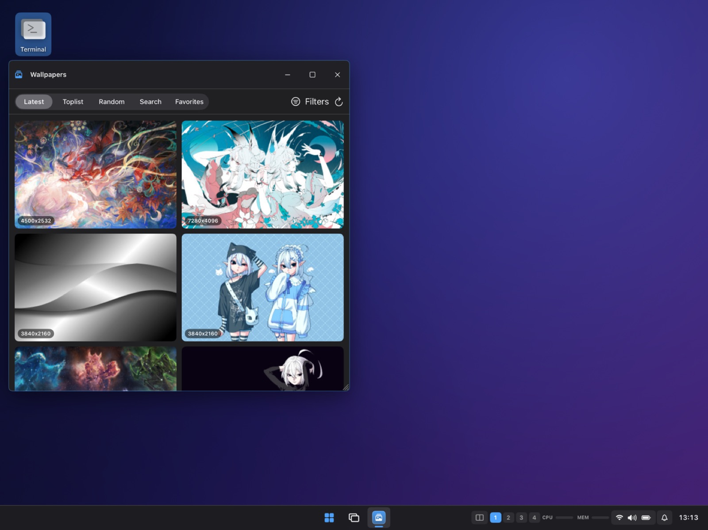
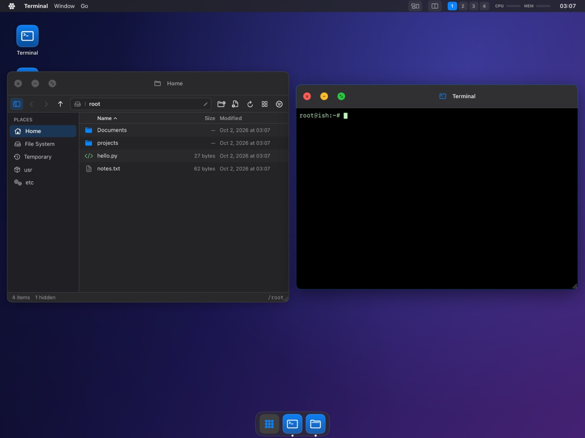
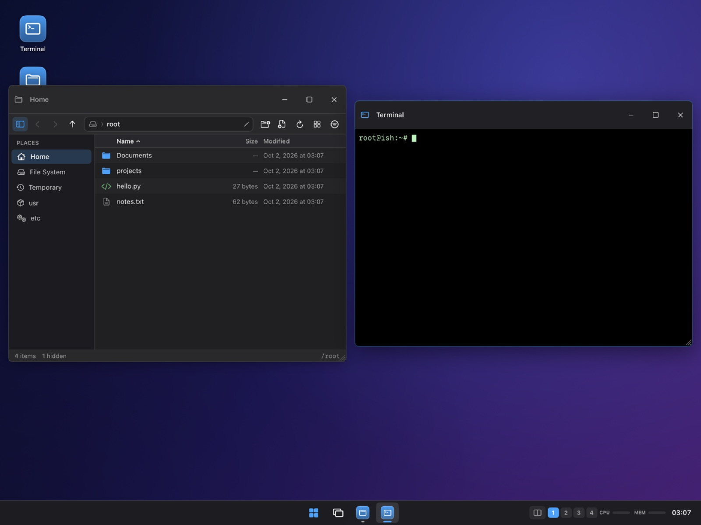
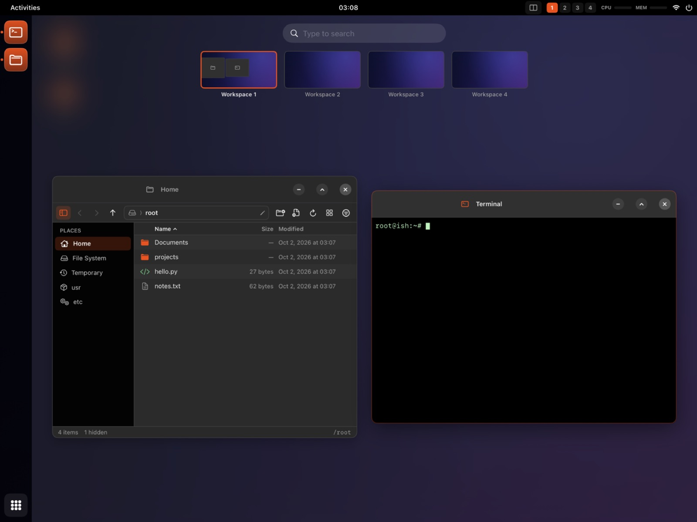
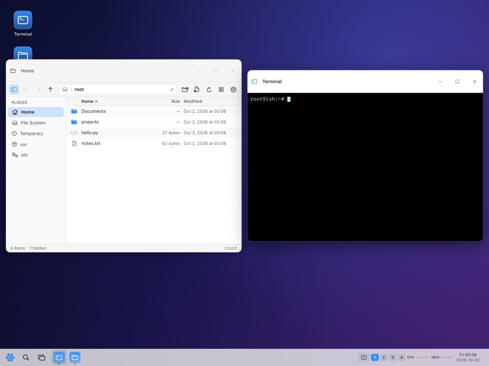
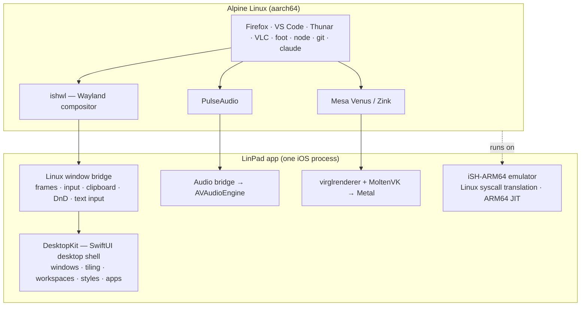

<p align="center">
  
</p>

<h1 align="center">LinPad — Linux for iPad</h1>

<p align="center">
  <strong>A real Linux desktop on your iPad</strong><br>
  <em>Windows, tiling, workspaces and real Linux apps — Firefox, VS Code, Thunar, VLC, Node, git, Claude Code — running on the iPad itself. No VM. No jailbreak. One app.</em>
</p>

<p align="center">
  <a href="https://www.youtube.com/@Ambsd-yy7os">
    
  </a>
  <a href="https://x.com/AmbsdOP">
    
  </a>
  <a href="https://webdesignstudio.london">
    
  </a>
</p>

<p align="center">
  <a href="#-screenshots">Screenshots</a> •
  <a href="#-why-linpad">Why LinPad</a> •
  <a href="#-features">Features</a> •
  <a href="#-how-it-works">How it works</a> •
  <a href="#-quick-start">Quick start</a> •
  <a href="#-keyboard--trackpad">Shortcuts</a> •
  <a href="#-roadmap">Roadmap</a>
</p>

<p align="center">
  
  
  
  
  
  
  
</p>

---

## 📸 Screenshots

<p align="center">
  
</p>

<p align="center">
  <em>Real Firefox, rendering Wikipedia, as a native window on the iPad</em>
</p>

| | |
|:---:|:---:|
| <br>**Visual Studio Code** with TypeScript, git and Claude Code | <br>**foot terminal** + fastfetch |
| <br>**Thunar** as a native window | <br>**Wallhaven** wallpapers built in |
| <br>**macOS** style | <br>**Windows** style |
| <br>**Ubuntu** style overview | <br>**Kylin** style |

---

## 🚀 Why LinPad?

**The iPad Air M3 is as fast as a MacBook Air.** Put a Logitech keyboard with a trackpad on it and it looks like a laptop — but it can't do laptop things. No real terminal. No VS Code. No Linux tools. A powerful machine that ends up as a Netflix screen.

LinPad turns it into the computer the hardware already is.

| | Stock iPadOS | LinPad |
|---|---|---|
| **Desktop** | Stage Manager | **Real windowed desktop** with tiling, snapping, workspaces |
| **Terminal** | Toy shells | **Full Alpine Linux** — apk, bash, Node, Python, git |
| **Code editor** | Web-based at best | **Visual Studio Code** (the real one) |
| **Browser engine** | WebKit only | **Firefox** + Safari's engine side by side |
| **Linux GUI apps** | ❌ | **Thunar, Mousepad, VLC, GTK & Qt apps** |
| **AI coding** | ❌ | **Claude Code** in the terminal and VS Code |
| **Keyboard + trackpad** | Partial | **Right-click, shortcuts, pointer everywhere** |
| **Cost** | — | **Free & open source** |

---

## ✨ Features

### 🖥️ Native Desktop
| Feature | Description |
|---------|-------------|
| **Window manager** | Move, resize from any edge, snap to halves and quarters, maximize, minimize to the taskbar |
| **Auto-tiling** | Master-stack, columns, grid and monocle layouts — on or off per workspace, float any window |
| **Workspaces** | Switch with keys or three-finger swipes, drag windows between them in the overview |
| **Overview & switcher** | Exposé-style overview, ⌥Tab switcher with live thumbnails, taskbar hover previews |
| **Notification center** | History, Do Not Disturb, swipe to dismiss |
| **Quick settings** | Volume, brightness, appearance, style, tiling, battery, network, fast mode |
| **Lock screen & session** | Lock, restart the desktop session, session restore on launch |

### 🎨 Styles & Themes
| Feature | Description |
|---------|-------------|
| **Five desktop styles** | LinPad, Windows, macOS, Ubuntu, Kylin — each changes the *layout*, not just colours |
| **Matching Linux themes** | GTK & Qt themes, cursors and fonts follow the style (Fluent, WhiteSur, Yaru, UKUI, Adwaita) |
| **Icon packs** | Papirus, Fluent, WhiteSur, Yaru, UKUI and more — independent of the style |
| **Light & dark** | Per style, or follow iPadOS |
| **Wallpapers** | Photos, Files, `~/Pictures`, or browse [Wallhaven](https://wallhaven.cc) (SFW only) right from the desktop |

### 🐧 Real Linux
| Feature | Description |
|---------|-------------|
| **Alpine Linux 3.21** | Unmodified aarch64 binaries, full `apk` package manager |
| **Linux GUI apps as native windows** | Built-in Wayland compositor — every Linux window is a real iPad window |
| **Firefox** | The real thing, tuned for LinPad |
| **Visual Studio Code** | Microsoft's official build, installed on first use, with extensions & the integrated terminal |
| **Developer tools** | Node 22, npm, git, Python, Vite with hot reload, TypeScript, Claude Code |
| **Lean by design** | Optional apps — mail, PDF viewer, office, image editor, VLC — are *ticked* by you, never preinstalled |

### ⚡ Performance
| Feature | Description |
|---------|-------------|
| **Native ARM64 JIT** | ≈4.8× faster than the threaded-code engine — `tsc` 5.4×, Node 12×, `vite build` 3.5× |
| **Fast mode in one tap** | Hands off to [StikDebug](https://github.com/StikDebug/StikDebug) at launch and comes back with JIT enabled |
| **GPU acceleration** | Linux Vulkan & OpenGL ES on the Apple GPU (Venus → virglrenderer → MoltenVK → Metal) |
| **Firefox** | Scrolling at 30–50 fps, URL bar in ~40 ms |

### ⌨️ Input & Integration
| Feature | Description |
|---------|-------------|
| **Keyboard, trackpad, touch** | All first-class; touch-sized controls when no keyboard is attached |
| **Right-click everywhere** | Desktop, Files, title bars, taskbar, and inside Linux apps |
| **Text input for every language** | Accents, emoji, dictation, Japanese & Chinese composition — in Linux apps too |
| **Clipboard & drag-and-drop** | Between Linux apps, native apps and iPadOS |
| **Sound** | Linux audio plays through iOS |
| **Files app** | Thunar-style manager with Trash, Open With, Properties, desktop as a real folder |

---

## 🧠 How it works

LinPad does not run a virtual machine and needs no jailbreak — it is **one iPad app**.



| Layer | What it does |
|-------|-------------|
| **Emulator** | Fork of [iSH](https://github.com/ish-app/ish) / [iSH-ARM64](https://github.com/meikis/ish-arm64): translates Linux system calls to iOS; LinPad adds a native ARM64 JIT and dozens of kernel fixes (signals, sockets, memory, inotify, netlink, futexes, memfd, virtio-gpu) |
| **ishwl** | A small Wayland compositor inside Linux; each window's pixels are shared through memory-mapped files, input goes back through FIFOs |
| **DesktopKit** | The native SwiftUI desktop — one window manager for native apps and Linux windows |
| **GPU** | A virtio-gpu device in the emulator feeds virglrenderer's Venus renderer, running on MoltenVK and Metal |

---

## ⚡ Quick start

| Requirement | Specification |
|-------------|---------------|
| **iPad** | Apple Silicon (M1 or newer) — developed on an iPad Air M3, iPadOS 27.2 |
| **Mac** | Xcode, Homebrew `llvm lld meson ninja libarchive`, `libimobiledevice` |
| **Account** | An Apple developer account (LinPad is sideloaded, not on the App Store) |
| **Optional** | [StikDebug](https://github.com/StikDebug/StikDebug) + LocalDevVPN for fast mode |

```sh
export PATH=/opt/homebrew/opt/lld/bin:/opt/homebrew/opt/llvm/bin:$PATH

gpu/build-third-party.sh          # virglrenderer + MoltenVK (once)
release/build-rootfs.sh           # the Alpine system image (~50 min)

xcodebuild -project iSH.xcodeproj -target iSH-ARM64 -configuration Release -sdk iphoneos \
  -allowProvisioningUpdates SYMROOT=$PWD/build-ios-release IPHONEOS_DEPLOYMENT_TARGET=17.0 \
  DEVELOPMENT_TEAM=<your team> ISH_JIT_BUILD=enabled build

release/embed-rootfs.sh --device "build-ios-release/Release-iphoneos/iSH ARM64.app" \
  release/out/ish-linux-rootfs-arm64.tar.gz
ideviceinstaller install "build-ios-release/Release-iphoneos/iSH ARM64.app"
```

Full guide: **[release/INSTALL-DEVICE.md](release/INSTALL-DEVICE.md)**

> Visual Studio Code is Microsoft's proprietary build. It is downloaded on your iPad when you choose to install it and is never redistributed by this project.

---

## ⌨️ Keyboard & trackpad

| Shortcut | Action |
|----------|--------|
| `⌃⌥A` | Applications |
| `⌃⌥T` | New terminal |
| `⌃⌥W` | Close window |
| `⌃⌥M` | Minimize |
| `⌃⌥←` `⌃⌥→` `⌃⌥↑` | Snap left / right / maximize |
| `⌃⌥U` `I` `J` `K` | Snap to quarters |
| `⌃⌥⇧T` | Toggle auto-tiling |
| `⌃⌥O` | Overview |
| `⌥Tab` | Window switcher |
| `⌃⌥1…9` | Switch workspace |
| `⌘ …` | Goes to the app (⌘S saves, ⌘W closes a tab, ⌘C/⌘V copy & paste) |
| Two-finger click | Right-click |
| Three-finger swipe | Overview / switch workspace |

---

## 🗺️ Roadmap

- [x] Native desktop with tiling, snapping, workspaces, five styles
- [x] Real Firefox, VS Code, Thunar, VLC as native windows
- [x] Native ARM64 JIT with one-tap fast mode
- [x] GPU acceleration via Venus → Metal
- [x] Wallhaven wallpapers, icon packs, notification center
- [ ] Optional app catalog: mail client, PDF viewer, office, image editor (tick to install)
- [ ] iPad Files & Photos access from Linux
- [ ] Quick Look with Space, like macOS
- [ ] Faster Firefox page loads, lower memory

---

## 💻 Tech stack

| Layer | Technologies |
|-------|-------------|
| **Desktop** | Swift, SwiftUI, UIKit |
| **Emulator** | C, ARM64 assembly, iSH, meson |
| **Linux** | Alpine Linux 3.21, Mesa (Venus/Zink), PulseAudio, GTK, Qt |
| **Graphics** | Wayland, virglrenderer, MoltenVK, Metal |

---

## 👤 About the Author

LinPad is built and maintained by **Vali** — open-source developer and founder of [Web Design Studio London](https://webdesignstudio.london), a specialist web design and development studio serving London businesses and international clients.

I bought an iPad Air M3, attached a Logitech keyboard with a trackpad, and realised I owned a laptop-class machine that couldn't run a terminal, an editor or a real browser. LinPad is the fix.

---

## 🙏 Credits

- **[iSH](https://github.com/ish-app/ish)** — the Linux shell for iOS that started it all
- **[iSH-ARM64](https://github.com/meikis/ish-arm64)** — the native ARM64 guest backend LinPad builds on
- **[Alpine Linux](https://alpinelinux.org)** — the lightweight Linux underneath
- **[Mesa](https://mesa3d.org)**, **[virglrenderer](https://gitlab.freedesktop.org/virgl/virglrenderer)**, **[MoltenVK](https://github.com/KhronosGroup/MoltenVK)** — the GPU path
- **[StikDebug](https://github.com/StikDebug/StikDebug)** — JIT on modern iPadOS
- **[Wallhaven](https://wallhaven.cc)** — wallpapers
- The open-source themes and icon packs in `themes/`, each under its own license

---

## 📄 License

LinPad is licensed under the **GPLv3**, like iSH — see [LICENSE.md](LICENSE.md). The original iSH README is kept at [docs/README-iSH.md](docs/README-iSH.md).

---

<p align="center">
  <strong>⭐ If LinPad turned your iPad into a real computer, please star this repo! ⭐</strong>
</p>

<p align="center">
  <em>Made with ❤️ for everyone whose iPad deserves more than Netflix</em>
</p>

<p align="center">
  <strong>Stop using your iPad as a TV. Start using it as a computer.</strong>
</p>
