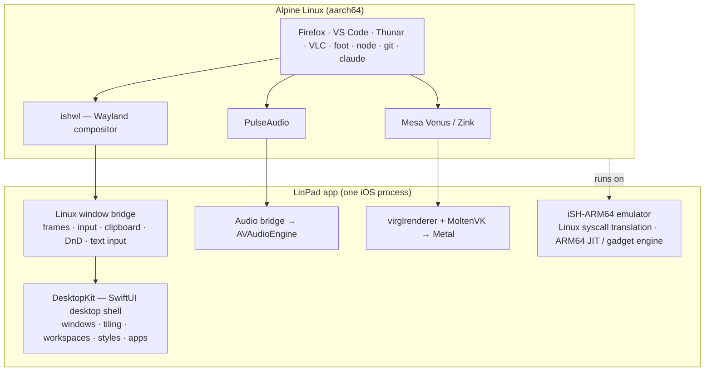

# LinPad — Linux for iPad

**A real Linux desktop on the iPad.** Windows, a taskbar, tiling, workspaces, and real Linux apps — Firefox, VS Code, Thunar, VLC, a terminal with Node, git and Claude Code — running on the iPad itself, with keyboard, trackpad and touch.


## Why

The iPad Air M3 is as fast as a MacBook Air. With a Logitech keyboard and trackpad attached, it looks like a laptop — but it can't do laptop things. No real terminal, no real browser engine choice, no VS Code, no Linux tools. LinPad turns it into the computer the hardware already is.

## What you get

- **A native desktop**, written in SwiftUI and tuned for landscape: movable/resizable windows, snapping (halves, quarters), **auto-tiling** (master-stack, columns, grid, monocle), overview, window switcher, dynamic workspaces, notification center, quick settings, lock screen.
- **Five desktop styles** that change the layout, not just the colours: LinPad, Windows, macOS, Ubuntu and Kylin (UKUI) — each with matching GTK/Qt themes, icon packs and cursors. Switchable icon packs (Papirus, Fluent, WhiteSur, Yaru, Breeze and more).
- **Real Linux apps as native windows** through a built-in Wayland compositor: Firefox, Thunar, Mousepad, foot, VLC, Visual Studio Code (installed on first use), and anything from Alpine's package repository.
- **Developer tools**: Node 22, npm, git, Python, Vite (with hot reload), TypeScript, Claude Code.
- **GPU acceleration** for Linux Vulkan and OpenGL ES apps on the Apple GPU (Venus → virglrenderer → MoltenVK → Metal).
- **Sound** from Linux apps, **clipboard** and **drag-and-drop** between Linux apps, native apps and iPadOS, **text input** for every language (accents, emoji, Japanese/Chinese composition).
- **Keyboard, trackpad and touch** all first-class: ⌘ shortcuts go to the app, desktop commands live on ⌃⌥, right-click everywhere, touch-sized controls when no keyboard is attached.
- **Wallpapers** from your Photos, Files, or the [Wallhaven](https://wallhaven.cc) browser built in (SFW only).
- **Lean by default**: optional apps (VS Code, multimedia, extra browsers, mail, PDF viewer, …) are ticked at first run or later in Settings — nothing is preinstalled that you didn't ask for.

| | |
|---|---|
|  |  |
|  |  |
|  |  |
|  |  |

## How it works

LinPad does not run a virtual machine and does not need a jailbreak. It is one iPad app.



- **The emulator** is a fork of [iSH](https://github.com/ish-app/ish) with a native ARM64 guest backend ([iSH-ARM64](https://github.com/meikis/ish-arm64)). Linux programs are real, unmodified Alpine aarch64 binaries; their system calls are translated to iOS. LinPad adds a native **ARM64→ARM64 JIT** (≈4.8× faster than the threaded-code engine on our benchmark suite), dozens of syscall/signal/socket/memory fixes, inotify, netlink, PI futexes, memfd and a virtio-gpu device.
- **ishwl** is a small Wayland compositor running inside Linux. Each Linux window becomes its own native window in the desktop; pixels are shared through memory-mapped files, input and window events go back through FIFOs. HiDPI, popups, clipboard, drag-and-drop and text-input-v3 are supported.
- **DesktopKit** is the native desktop — a SwiftUI package hosting both native apps (Files, Text Editor, Terminal, Settings, Wallpapers, …) and Linux windows with the same window manager.
- **Fast mode**: the JIT needs iPadOS's JIT permission. With [StikDebug](https://github.com/StikDebug/StikDebug) installed, LinPad hands off to it at launch and comes back with JIT enabled — one tap. Without it, LinPad runs in compatibility mode.

Some numbers (Apple M-series, `tests/perf/bench.py`): `tsc` 5.4×, `vite build` 3.5×, Node loops 12× faster with the JIT; Firefox scrolls at 30–50 fps and the URL bar responds in ~40 ms.

## Status

Early, moving fast, tested daily on an iPad Air M3 (iPadOS 27.2) with a Logitech keyboard + trackpad. Not on the App Store — LinPad is sideloaded with your own developer account.

Coming next: a mail client and PDF viewer as optional installs, iPad Files/Photos access from Linux, Quick Look with Space, more icon packs.

## Build it

Requirements: a Mac with Xcode, Homebrew `llvm lld meson ninja libarchive`, `libimobiledevice`/`ideviceinstaller`, and an Apple developer account.

```sh
export PATH=/opt/homebrew/opt/lld/bin:/opt/homebrew/opt/llvm/bin:$PATH
gpu/build-third-party.sh                       # virglrenderer + MoltenVK (once)
release/build-rootfs.sh                        # the Alpine system image (~50 min)
xcodebuild -project iSH.xcodeproj -target iSH-ARM64 -configuration Release -sdk iphoneos \
  -allowProvisioningUpdates SYMROOT=$PWD/build-ios-release IPHONEOS_DEPLOYMENT_TARGET=17.0 \
  DEVELOPMENT_TEAM=<your team> ISH_JIT_BUILD=enabled build
release/embed-rootfs.sh --device "build-ios-release/Release-iphoneos/iSH ARM64.app" \
  release/out/ish-linux-rootfs-arm64.tar.gz
ideviceinstaller install "build-ios-release/Release-iphoneos/iSH ARM64.app"
```

Full instructions: [release/INSTALL-DEVICE.md](release/INSTALL-DEVICE.md). Design docs: [Wayland bridge](wl-bridge/DESIGN.md) · [GPU](gpu/DESIGN.md) · [JIT](jit/DESIGN.md) · [Themes contract](themes/CONTRACT.md) · [Drag-and-drop](wl-bridge/DND-SPEC.md) · [Emulator perf](asbestos/guest-arm64/PERF.md).

Visual Studio Code is Microsoft's proprietary build; it is downloaded on the device at install time and never redistributed by this project.

## Credits & license

LinPad builds on [iSH](https://github.com/ish-app/ish) (GPLv3, see [LICENSE.md](LICENSE.md) and [docs/README-iSH.md](docs/README-iSH.md)) and [iSH-ARM64](https://github.com/meikis/ish-arm64), [Alpine Linux](https://alpinelinux.org), [Mesa](https://mesa3d.org), [virglrenderer](https://gitlab.freedesktop.org/virgl/virglrenderer), [MoltenVK](https://github.com/KhronosGroup/MoltenVK), and the open-source themes and icon packs listed in `themes/` (each under its own license). LinPad is licensed under GPLv3 like iSH.
